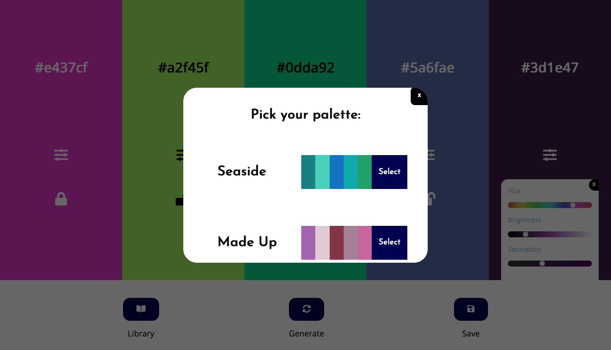

# Palette-Town

JavaScript (incl ChromaJS library) colour palette selection app with detailed refinement options and storage library

### Huh? Another colour picker? Wow...

Wait! I hear you, but before you move on and view something a little less generic sounding, please review the following features:

This particular colour picker has:

- Random colour generation
- Detailed hue, brightness and saturation sliders for customisation
- Clickable hex values to copy to clipboard
- Lockable colour panels to retain it in the palette while the rest randomise
- Save palette combinations into local storage by name
- Retrieve saved palettes in your library

See, it's an **_exceptional_** generic colour picker.

Thanks for stopping by!

Ryan :)
